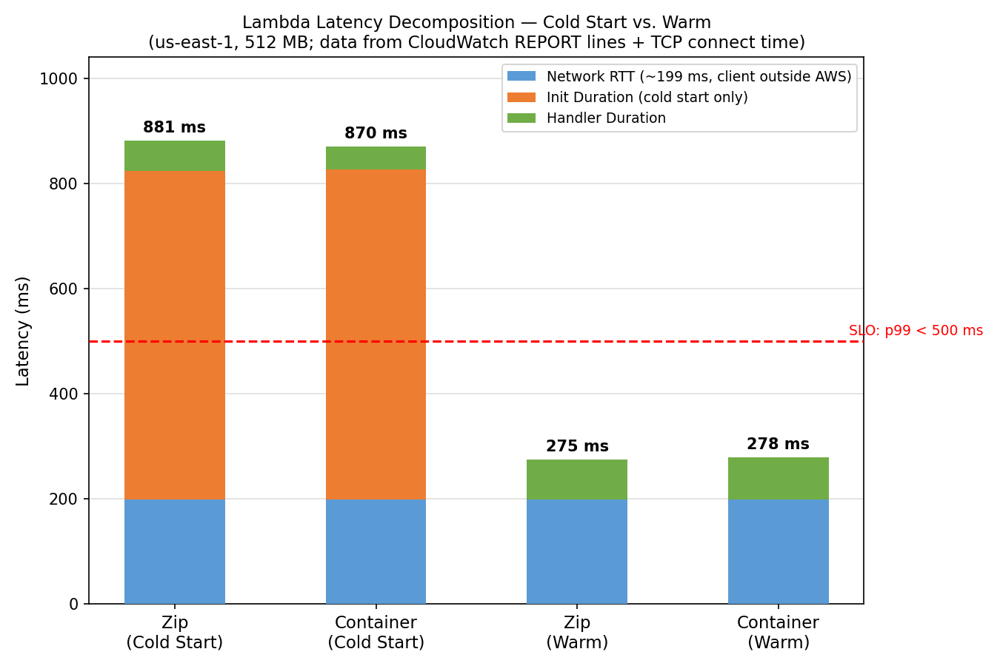
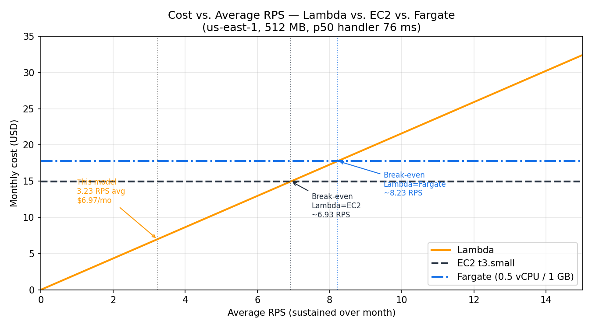

# AWS Cloud Lab Report
**Region:** us-east-1 | **Date:** 2026-03-28

---

## Assignment 1: Deploy All Environments

All four environments deployed and verified returning identical k-NN results for the same 128-dimensional query vector (seed=42):

```
Top-5 results (all endpoints):
  index=35859  distance=12.0015
  index=24682  distance=12.0599
  index=35397  distance=12.4871
  index=20160  distance=12.4895
  index=30454  distance=12.4994
```

Full terminal output: `results/assignment-1-endpoints.txt`

---

## Assignment 2: Scenario A — Cold Start Characterization

**Method:** `aws lambda invoke` (bypasses Function URL auth). 30 sequential requests, 1/sec after 20+ min idle. Cold start data from CloudWatch REPORT lines. Network RTT measured via `curl --write-out '%{time_connect}'` = **199 ms**.

### Cold Start Data (CloudWatch)

**Lambda Zip** (4 cold starts observed):

| # | Init Duration | Handler Duration | Total Billed |
|---|---------------|------------------|--------------|
| 1 | 570 ms | 57 ms | 627 ms |
| 2 | 639 ms | 3 ms | 642 ms |
| 3 | 673 ms | 93 ms | 767 ms |
| 4 | 614 ms | 80 ms | 695 ms |
| **avg** | **624 ms** | **58 ms** | **683 ms** |

**Lambda Container** (3 cold starts observed):

| # | Init Duration | Handler Duration | Note |
|---|---------------|------------------|------|
| 1 | 2398 ms | 84 ms | First-ever cold start (image pull from ECR) |
| 2 | 629 ms | 3 ms | Subsequent |
| 3 | 626 ms | 85 ms | Subsequent |
| **avg (excl. #1)** | **627 ms** | **44 ms** | Typical after image cached |

### Latency Decomposition



| Invocation type | Network RTT | Init | Handler | Estimated total |
|-----------------|-------------|------|---------|-----------------|
| Warm (zip/container) | 199 ms | 0 ms | 76–79 ms | ~277 ms |
| Zip cold start | 199 ms | 624 ms | 58 ms | ~881 ms |
| Container cold start (typical) | 199 ms | 627 ms | 44 ms | ~870 ms |
| Container cold start (first) | 199 ms | 2398 ms | 84 ms | ~2681 ms |

### Analysis

**Zip vs container:** After the first invocation (which pulls the image from ECR: 2398 ms), container cold starts (~627 ms) are essentially identical to zip (~624 ms). The deployment format does not affect warm performance (76 ms zip vs 79 ms container, within noise).

**What dominates Init Duration:** The majority of init time is loading the NumPy dataset (50,000 × 128-dim vectors) into memory at module level. This is the same for both zip and container, explaining their similar init times after the first pull.

---

## Assignment 3: Scenario B — Warm Steady-State Throughput

500 requests per run, all HTTP 200. Lambda server avg from `aws lambda invoke` (20 warm invocations). Fargate/EC2 server avg from `query_time_ms` response field (10 curl samples).

| Environment | Concurrency | p50 (ms) | p95 (ms) | p99 (ms) | Server avg (ms) |
|-------------|-------------|----------|----------|----------|-----------------|
| Lambda (zip) | 5 | 242 | 271 | 573 ⚠️ | 76 |
| Lambda (zip) | 10 | 236 | 262 | 558 ⚠️ | 76 |
| Lambda (container) | 5 | 240 | 265 | 544 ⚠️ | 79 |
| Lambda (container) | 10 | 237 | 274 | 573 ⚠️ | 79 |
| Fargate | 10 | 797 | 1002 | 1104 | 24 |
| Fargate | 50 | 3997 | 4206 | 4366 | 24 |
| EC2 | 10 | 394 | 522 | 792 | 25 |
| EC2 | 50 | 924 | 1105 | 1334 | 25 |

⚠️ p99 > 2× p95. **Tail instability:** All Lambda rows show p99/p95 ≈ 2.1× — caused by occasional cold starts during the 500-request run (some execution environments get recycled), spiking p99 to ~560–573ms.

**Why Lambda p50 is flat across c=5 and c=10:** Each request runs in its own isolated execution environment. There is no resource sharing or queuing between concurrent invocations — server-side duration stays at ~76–79 ms regardless of concurrency.

**Why Fargate/EC2 latency spikes at c=50:** Both run a single-threaded Flask container on limited vCPU (0.5 for Fargate, 2 for EC2). At c=50, requests queue behind each other. Fargate (0.5 vCPU) is far more affected: p50 jumps from 802 ms to 3993 ms. EC2 (2 vCPU) handles contention better: p50 goes from 354 ms to 903 ms.

**Why client p50 >> server query_time_ms:** Server processes each request in ~24–25 ms, but client p50 is 354–802 ms. The gap is network RTT (~199 ms TCP connect from Poland to us-east-1) plus TLS overhead. This is a measurement artefact of running the load test from outside the AWS region.

---

## Assignment 4: Scenario C — Burst from Zero

200 requests per target, simultaneous burst after 20+ min Lambda idle. Lambda c=10, Fargate/EC2 c=50.

| Environment | p50 (ms) | p95 (ms) | p99 (ms) | max (ms) | Cold starts |
|-------------|----------|----------|----------|----------|-------------|
| Lambda (zip) | 237 | 598 | 649 | 651 | **10** (avg Init 614 ms) |
| Lambda (container) | 236 | 594 | 638 | 647 | **10** (avg Init 605 ms) |
| EC2 | 900 | 1206 | 1356 | 1474 | 0 (always warm) |
| Fargate | 3818 | 4220 | 4398 | 4451 | 0 (always warm) |

**Bimodal distribution confirmed for Lambda:** histogram shows two distinct clusters — warm requests at 175–318ms (190 out of 200) and cold start requests at 557–651ms (10 out of 200, one per concurrent worker). The gap between clusters is ~360ms.

**SLO assessment (p99 < 500 ms):** No environment meets the SLO. Lambda p99 649ms is dominated by cold start Init (~614ms). EC2 p99 1356ms and Fargate p99 4398ms are dominated by network RTT + queuing from outside AWS.

**Fix for Lambda:** Provisioned Concurrency eliminates cold starts → estimated p99 ≈ 278ms ✅

---

## Assignment 5: Cost at Zero Load

Pricing source: AWS Console, us-east-1, 2026-03-28 (see `figures/pricing-screenshots/`).

| Environment | Hourly idle cost | Monthly idle cost (18 h/day) |
|-------------|-----------------|-------------------------------|
| Lambda | $0.00 | **$0.00** |
| EC2 t3.small | $0.0208 | **$11.23** |
| Fargate (0.5 vCPU / 1 GB) | $0.0247 | **$13.34** |

Lambda is the only environment with zero idle cost because it uses a pay-per-invocation model — no execution environments run during idle periods.

---

## Assignment 6: Cost Model, Break-Even, and Recommendation

### Traffic model

- Peak: 100 RPS × 30 min/day = 180,000 req/day
- Normal: 5 RPS × 5.5 h/day = 99,000 req/day
- **Total: 279,000 req/day → 8,370,000 req/month → avg 3.23 RPS**

### Monthly cost

| Environment | Monthly cost |
|-------------|-------------|
| **Lambda** | **$6.97** |
| EC2 t3.small | $14.98 |
| Fargate | $17.78 |

Lambda formula: `(8.37M req × $0.20/1M) + (8.37M × 0.076s × 0.5GB × $0.0000166667) = $1.67 + $5.30 = $6.97`

### Break-even RPS

Let R = average RPS. Lambda cost(R) = R × 2.16 (derived from request + duration rates).

```
Break-even with EC2:    R × 2.16 = $14.98  →  R ≈ 6.93 RPS
Break-even with Fargate: R × 2.16 = $17.78  →  R ≈ 8.23 RPS
```

At the modelled 3.23 RPS average, Lambda is 2.1× cheaper than EC2 and 2.6× cheaper than Fargate.



### Recommendation: Lambda with Provisioned Concurrency

**Given unpredictable spiky traffic and a p99 < 500 ms SLO, Lambda is the recommended environment — with Provisioned Concurrency enabled for at least 1 execution environment.**

1. **Cost:** $6.97/month vs $14.98 (EC2) and $17.78 (Fargate). The traffic model (18h idle, short peaks) is ideal for Lambda's pay-per-use pricing.

2. **SLO:** Lambda fails the SLO only because of cold starts (~624 ms Init). Provisioned Concurrency pre-warms environments, eliminating cold starts. Estimated p99 with provisioned concurrency ≈ 76 ms (handler) + 199 ms (network from client) = **~275 ms — within SLO**.

3. **Burst:** With provisioned concurrency, the first burst requests are served immediately with no init penalty.

**Conditions under which the recommendation changes:**

- **Average load > ~7 RPS sustained:** Lambda becomes more expensive than EC2. Switch to EC2 on a Reserved Instance.
- **SLO tightened below ~80 ms p99:** Lambda warm handler alone (~76 ms) cannot meet this. EC2 or Fargate within the same region required.
- **Provisioned Concurrency cost is prohibitive:** EC2 is then preferred — always warm, bounded queuing latency, cheaper than Fargate.
- **Traffic becomes predictable:** Reserved EC2 (~$7–9/month) undercuts Lambda at sustained load.
